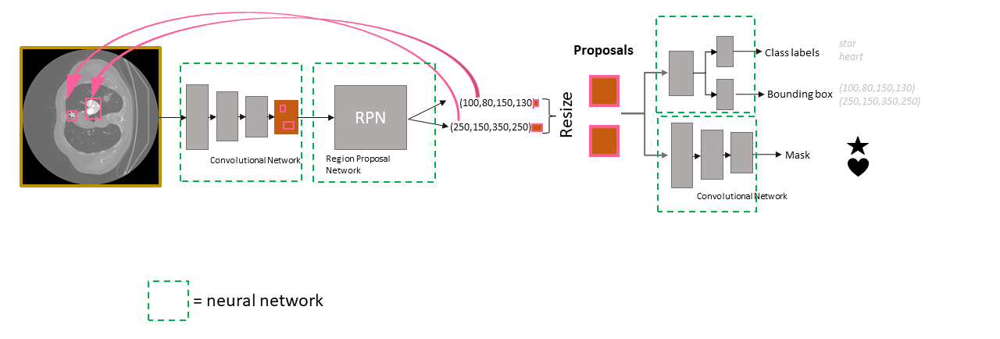

# Building a maskrcnn from scratch using tensorflow and keras

## Files:
- GenerateToyDataset_fromscratch.ipynb: script to generate toydataset using the masks, and LIDC-IDRI dataset. 
- ./masks/: folder containing two mask files to generate toydataset
(You need to download the LIDC-IDRI dataset, and have a config file as defined here:https://pylidc.github.io/install.html)

- MaskrCNN.ipynb: creating and training a Mask R-CNN from scratch, using the toydataset. All networks and trainsteps can be observed here.
- MaskrCNN_call.ipynb: Generating and training a new Mask R-CNN, or finetuning saved models can be done here. No functions defined here.

- model_utils.py: training/model functions like: creating network, batchgenerator, trainstep, trainloop, predict, losses are found here. 
- utils.py:   calculating helper functions + visualization functions are here

If you use my toydataset generation, you will need a path to:
  1. the CT slices
  2. the normalized CT slices
  3. the toydataset, which has to include an images and a masks folder

## Necessary packages you might not have: 
- to work with the nrrd files install pynrrd
- to work with LIDC-IDRI install pylidc

Franciska Rajki, Ulyssys Ltd. https://ulyssys.hu/
